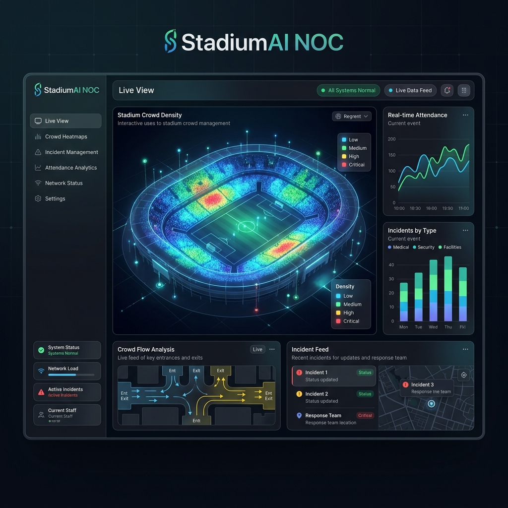

# StadiumAI NOC — Network Operations Center

StadiumAI NOC is a state-of-the-art Network Operations Center platform built to manage and optimize stadium crowd dynamics, security incidents, navigation routing, and live operations in real-time.



## Technology Stack

The platform is designed with a modern, full-stack serverless architecture optimized for high-throughput, low-latency client updates, and secure database interactions.

### Frontend
- **Framework & Tooling:** React 18, TypeScript, Vite, TailwindCSS (curated premium dark theme)
- **State Management:** Zustand
- **Icons:** Lucide React
- **Client Routing:** React Router DOM v6
- **Code Linter:** Oxlint (high-performance linter)

### Backend & API Layer
- **API Framework:** FastAPI (Python 3.12)
- **Deployment Platform:** Vercel Serverless Functions
- **Database Graph Layer:** Neo4j (hosted via AuraDB)
- **Real-Time Data Delivery:** High-frequency HTTP polling with auto-recovery
- **Caching & Rate Limiting:** Upstash Redis (falling back to local memory if offline)
- **AI Agent Integration:** Google Gemini API (via `google-generativeai`)
- **Logging:** Structlog (structured JSON logs)

---

## Getting Started

### Prerequisites
- Node.js (v18+)
- Python (3.11 or 3.12)
- Neo4j AuraDB instance (or local community server)
- Redis instance (optional, for rate-limiting persistent memory)

### Installation & Run

1. **Clone the Repository**
   ```bash
   git clone https://github.com/Subhadip6666/Smart-Stadiums-Tournament-Operations.git
   cd Smart-Stadiums-Tournament-Operations
   ```

2. **Frontend Setup**
   ```bash
   cd frontend
   npm install
   npm run dev
   ```

3. **Backend Setup**
   ```bash
   cd ../backend
   python -m venv .venv
   source .venv/bin/activate
   pip install -r requirements.txt
   uvicorn app.main:app --reload
   ```

---

## Infrastructure Security Configuration
To secure database connectivity in production environments, the platform is configured to restrict traffic to specified ports and networks. If you require custom VPC routes or IP allow-lists, please update your Neo4j Aura console to include only authorized serverless endpoints and Vercel egress IP ranges.