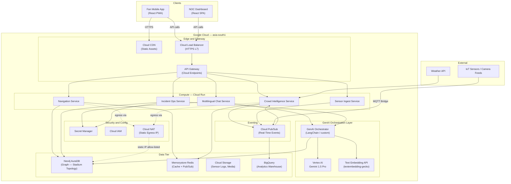
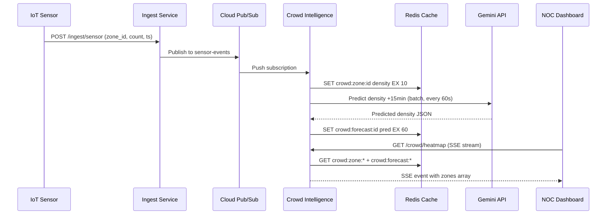
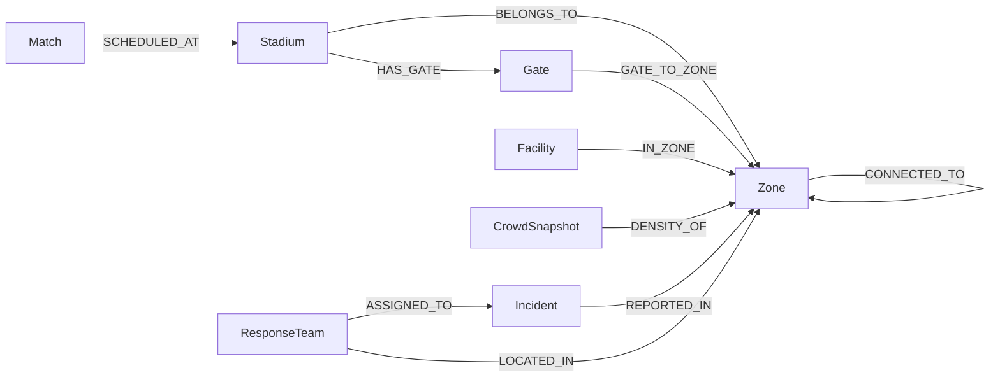
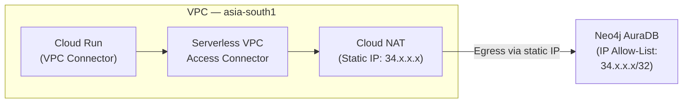
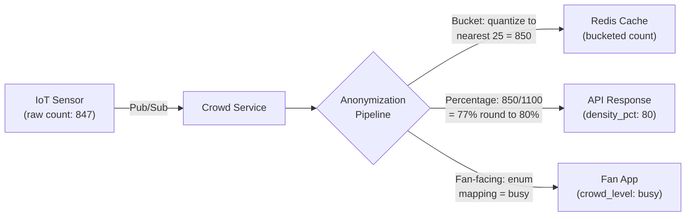

# StadiumAI NOC — Architecture Blueprint

> **GenAI-Enabled Smart Stadium Operations Platform**
> FIFA World Cup 2026 · Challenge 4
> Document Version: 1.0 · 2026-07-12

---

## Table of Contents

1. [Requirements Breakdown](#1-requirements-breakdown)
2. [System Architecture](#2-system-architecture)
3. [Data Model (Neo4j)](#3-data-model-neo4j)
4. [API Contract](#4-api-contract)
5. [Security Architecture](#5-security-architecture)
6. [Scalability Plan](#6-scalability-plan)
7. [Folder / Repo Structure](#7-folder--repo-structure)
8. [Risk Register](#8-risk-register)

---

## 1. Requirements Breakdown

### 1.1 Functional Requirements

| ID | Domain | Requirement | Priority |
|----|--------|-------------|----------|
| FR-01 | **Fan Navigation** | Real-time indoor wayfinding from any gate/zone to seats, concessions, restrooms, exits. Supports shortest-path and accessibility-optimized routing via Neo4j graph traversal. | P0 |
| FR-02 | **Crowd Density Prediction** | Ingest IoT sensor / camera-feed aggregate counts per zone, predict density 15-min ahead using Gemini time-series prompting, surface heatmap to NOC operators. | P0 |
| FR-03 | **Multilingual Assistant** | Conversational chat (text + voice-to-text) in **12+ FIFA languages** (EN, ES, FR, AR, PT, DE, ZH, JA, KO, HI, RU, IT) powered by Gemini 1.5 Pro multimodal. Context-aware: knows match schedule, stadium layout, user's current zone. | P0 |
| FR-04 | **Incident / Ops Intelligence** | NOC operators report incidents (medical, security, infrastructure); Gemini triages severity, recommends response playbook, suggests nearest available response team via graph query. | P0 |
| FR-05 | **Accessibility Routing** | Dedicated routing mode avoiding stairs, narrow corridors; surfaces elevator/ramp paths; wheelchair-accessible restrooms & seating flagged in graph. | P1 |
| FR-06 | **Match-Day Dashboard** | NOC single-pane-of-glass: live crowd density map, incident timeline, GenAI-summarised situation reports, weather overlay. | P1 |
| FR-07 | **Fan Feedback Loop** | Post-event sentiment capture via multilingual assistant; aggregated sentiment scores stored for operational learning. | P2 |

### 1.2 Non-Functional Requirements

| ID | Category | Requirement | Target |
|----|----------|-------------|--------|
| NFR-01 | **Latency — Crowd Data** | Sensor-to-dashboard propagation (ingest → process → render) | ≤ 3 s p95 |
| NFR-02 | **Latency — Navigation** | Graph shortest-path query response | ≤ 500 ms p99 |
| NFR-03 | **Latency — Chat** | First-token time for multilingual assistant | ≤ 1.5 s p95 |
| NFR-04 | **Uptime** | Platform availability during match windows (3 h pre-match → 1 h post-match) | 99.9 % |
| NFR-05 | **Multilingual Coverage** | Languages supported at launch | 12 (see FR-03) |
| NFR-06 | **Data Privacy** | Fan location data anonymized before storage; no PII in crowd density payloads; GDPR/CCPA-aligned retention (48 h raw → purge, aggregates retained 90 d) | Compliant |
| NFR-07 | **Throughput** | Concurrent fan chat sessions per stadium | 10 000 |
| NFR-08 | **Scalability** | Cloud Run instances scale from 2 → 200 per service within 60 s | Auto |
| NFR-09 | **Observability** | Structured logs, distributed traces (OpenTelemetry), custom metrics in Cloud Monitoring | Full stack |

---

## 2. System Architecture

### 2.1 High-Level Architecture Diagram



### 2.2 Component Responsibilities

| Component | Responsibility | Runtime |
|-----------|---------------|---------|
| **API Gateway** | Auth (JWT validation), rate limiting, request routing, CORS | Cloud Endpoints |
| **Navigation Service** | Shortest-path & accessibility-path queries against Neo4j; caches hot routes in Redis | Cloud Run (Python/FastAPI) |
| **Crowd Intelligence Service** | Consumes sensor events from Pub/Sub, maintains zone density in Redis, serves heatmap API, triggers Gemini prediction for 15-min forecast | Cloud Run (Python/FastAPI) |
| **Multilingual Chat Service** | Manages conversation state, routes prompts through GenAI Orchestrator, streams responses via SSE | Cloud Run (Python/FastAPI) |
| **Incident Ops Service** | CRUD for incidents, Gemini-powered triage & playbook recommendation, nearest-team lookup via Neo4j | Cloud Run (Python/FastAPI) |
| **Sensor Ingest Service** | Lightweight ingestion endpoint for IoT bridge; publishes to Pub/Sub topic `sensor-events` | Cloud Run (Python/FastAPI) |
| **GenAI Orchestrator** | Prompt construction, context injection (stadium graph summaries, crowd state), Gemini API call management, response post-processing, hallucination guardrails | Library within Chat & Incident services |
| **Neo4j AuraDB** | Stadium topology graph (zones, gates, routes, facilities); incident & team nodes | Managed (GCP Marketplace) |
| **Memorystore Redis** | Cache crowd density per zone (TTL 10 s), session state for chat, Pub/Sub fan-out for dashboard SSE | Managed |
| **Cloud Pub/Sub** | Decouples sensor ingest from processing; topics: `sensor-events`, `incidents`, `crowd-alerts` | Managed |
| **BigQuery** | Long-term analytics: crowd density time-series, incident history, chat sentiment aggregates | Managed |

### 2.3 Real-Time Event Flow



---

## 3. Data Model (Neo4j)

### 3.1 Node Labels & Properties

| Label | Properties | Description |
|-------|-----------|-------------|
| `Stadium` | `id`, `name`, `city`, `country`, `capacity`, `geo_lat`, `geo_lon` | Top-level venue |
| `Zone` | `id`, `name`, `type` (enum: `seating`, `concourse`, `concession`, `restroom`, `medical`, `vip`, `media`, `exit`), `level`, `capacity`, `is_accessible` | Discrete area within stadium |
| `Gate` | `id`, `name`, `type` (enum: `entry`, `exit`, `emergency`), `geo_lat`, `geo_lon`, `is_accessible` | Entry/exit points |
| `CrowdSnapshot` | `id`, `zone_id`, `density_pct`, `headcount_bucket` (enum: `low`, `medium`, `high`, `critical`), `timestamp` | Point-in-time anonymous density (no raw count client-side) |
| `Incident` | `id`, `type` (enum: `medical`, `security`, `infrastructure`, `weather`), `severity` (1–5), `status`, `description`, `zone_id`, `created_at`, `resolved_at` | Operational incident |
| `ResponseTeam` | `id`, `name`, `type` (enum: `medical`, `security`, `maintenance`), `current_zone_id`, `status` (enum: `available`, `deployed`, `off_duty`) | First-responder unit |
| `Facility` | `id`, `name`, `type` (enum: `restroom`, `concession`, `first_aid`, `atm`, `info_desk`), `is_accessible`, `zone_id` | Points of interest |
| `Match` | `id`, `home_team`, `away_team`, `kickoff_time`, `stadium_id`, `status` | Match schedule |

### 3.2 Relationships

| Relationship | From → To | Properties | Description |
|-------------|-----------|------------|-------------|
| `CONNECTED_TO` | `Zone` → `Zone` | `distance_m`, `walk_time_s`, `is_accessible`, `is_emergency_only`, `congestion_weight` | Traversable path between zones |
| `HAS_GATE` | `Stadium` → `Gate` | — | Stadium contains gate |
| `GATE_TO_ZONE` | `Gate` → `Zone` | `distance_m`, `walk_time_s`, `is_accessible` | Gate connects to first zone |
| `IN_ZONE` | `Facility` → `Zone` | — | Facility located in zone |
| `BELONGS_TO` | `Zone` → `Stadium` | — | Zone within stadium |
| `REPORTED_IN` | `Incident` → `Zone` | — | Incident location |
| `ASSIGNED_TO` | `ResponseTeam` → `Incident` | `assigned_at` | Team deployed to incident |
| `LOCATED_IN` | `ResponseTeam` → `Zone` | `updated_at` | Current team position |
| `SCHEDULED_AT` | `Match` → `Stadium` | — | Match venue |
| `DENSITY_OF` | `CrowdSnapshot` → `Zone` | — | Density reading for zone |

### 3.3 Schema Diagram



### 3.4 Example Cypher Queries

#### Shortest Path — Gate to Seat Zone

```cypher
// Shortest path from Gate G-A1 to Seating Zone S-204
MATCH (start:Gate {id: 'G-A1'})-[:GATE_TO_ZONE]->(startZone:Zone),
      (end:Zone {id: 'S-204'})
CALL apoc.algo.dijkstra(startZone, end, 'CONNECTED_TO', 'walk_time_s')
YIELD path, weight AS total_walk_time_s
RETURN [n IN nodes(path) | n.name] AS route,
       total_walk_time_s
ORDER BY total_walk_time_s
LIMIT 1
```

#### Accessibility-Safe Path (Avoids Non-Accessible Segments)

```cypher
// Accessible path: only traverse accessible edges and zones
MATCH (start:Gate {id: 'G-A1', is_accessible: true})-[:GATE_TO_ZONE]->(startZone:Zone),
      (end:Zone {id: 'S-204'})
CALL apoc.algo.dijkstra(
  startZone, end, 'CONNECTED_TO>',
  'walk_time_s',
  {relationshipFilter: 'CONNECTED_TO',
   nodeFilter: 'Zone',
   nodeProperties: {is_accessible: true},
   relProperties: {is_accessible: true}}
)
YIELD path, weight AS total_walk_time_s
RETURN [n IN nodes(path) | n.name] AS route,
       total_walk_time_s
LIMIT 1
```

#### Crowd-Aware Routing (Avoids High-Density Zones)

```cypher
// Dynamically weight edges by congestion_weight (updated from Redis cache)
MATCH (start:Zone {id: 'Z-CONC-A'}), (end:Zone {id: 'Z-EXIT-3'})
CALL apoc.algo.dijkstra(
  start, end, 'CONNECTED_TO',
  'congestion_weight'
)
YIELD path, weight AS congestion_cost
RETURN [n IN nodes(path) | {name: n.name, type: n.type}] AS route,
       congestion_cost
LIMIT 3
```

#### Nearest Available Medical Team to Incident Zone

```cypher
// Find closest available medical team to incident zone
MATCH (incident:Incident {id: 'INC-0042'})-[:REPORTED_IN]->(incidentZone:Zone)
MATCH (team:ResponseTeam {type: 'medical', status: 'available'})-[:LOCATED_IN]->(teamZone:Zone)
CALL apoc.algo.dijkstra(teamZone, incidentZone, 'CONNECTED_TO', 'walk_time_s')
YIELD weight AS eta_seconds
RETURN team.name, team.id, eta_seconds
ORDER BY eta_seconds
LIMIT 3
```

#### Zone Density Heatmap (Latest Snapshots)

```cypher
// Latest density snapshot per zone for heatmap rendering
MATCH (z:Zone)-[:BELONGS_TO]->(s:Stadium {id: 'STD-LUS'})
OPTIONAL MATCH (cs:CrowdSnapshot)-[:DENSITY_OF]->(z)
WITH z, cs
ORDER BY cs.timestamp DESC
WITH z, head(collect(cs)) AS latest
RETURN z.id, z.name, z.type, z.level,
       latest.density_pct,
       latest.headcount_bucket,
       latest.timestamp
```

---

## 4. API Contract

### 4.1 Authentication Scheme

| Consumer | Auth Method | Details |
|----------|------------|---------|
| **Fan App** | Firebase Auth → JWT (Bearer token) | Short-lived ID tokens; refresh via Firebase SDK. Claims: `sub`, `locale`, `zone` (optional). No PII beyond anonymous UID. |
| **NOC Dashboard** | Google Identity Platform → JWT | Operator identity; custom claim `role: operator \| admin`. MFA enforced. |
| **Service-to-Service** | Google Service Account (OIDC) | Each Cloud Run service has a dedicated SA. Audience-scoped OIDC tokens for inter-service calls. |
| **IoT Ingest** | API Key + mTLS | Device-authenticated; API key validated at Gateway; mTLS for transport. |

### 4.2 Endpoints

> Base URL: `https://api.stadiumai-noc.run.app/v1`
> All responses follow envelope: `{ "data": ..., "meta": { "request_id": "...", "timestamp": "..." } }`
> Errors: `{ "error": { "code": "...", "message": "...", "details": [...] } }`

---

#### 4.2.1 Navigation Service

##### `GET /navigate/route`

Find optimal route between two points.

**Query Parameters:**

| Param | Type | Required | Description |
|-------|------|----------|-------------|
| `from` | string | Yes | Origin node ID (gate or zone) |
| `to` | string | Yes | Destination node ID (zone or facility) |
| `mode` | enum | No | `shortest` (default), `accessible`, `crowd_aware` |
| `stadium_id` | string | Yes | Stadium identifier |

**Response 200 OK:**

```json
{
  "data": {
    "route_id": "rt-a1b2c3",
    "mode": "accessible",
    "segments": [
      {
        "from": { "id": "G-A1", "name": "Gate A1", "type": "gate" },
        "to": { "id": "Z-CONC-A", "name": "Concourse A", "type": "concourse" },
        "distance_m": 45,
        "walk_time_s": 38,
        "instruction": "Proceed through Gate A1, follow ramp to Concourse A",
        "is_accessible": true
      }
    ],
    "total_distance_m": 312,
    "total_walk_time_s": 265,
    "warnings": ["Zone Z-CONC-B has high crowd density — rerouted"]
  }
}
```

**Auth:** Fan JWT or NOC JWT

---

##### `GET /navigate/facilities`

Find nearest facilities by type.

**Query Parameters:**

| Param | Type | Required | Description |
|-------|------|----------|-------------|
| `zone_id` | string | Yes | Current zone |
| `type` | enum | Yes | `restroom`, `concession`, `first_aid`, `atm`, `info_desk` |
| `accessible_only` | bool | No | Default `false` |
| `limit` | int | No | Default `3`, max `10` |

**Response 200 OK:**

```json
{
  "data": {
    "facilities": [
      {
        "id": "FAC-R12",
        "name": "Restroom Level 2 North",
        "type": "restroom",
        "is_accessible": true,
        "zone": { "id": "Z-L2-N", "name": "Level 2 North" },
        "distance_m": 85,
        "walk_time_s": 72,
        "crowd_status": "low"
      }
    ]
  }
}
```

**Auth:** Fan JWT

---

#### 4.2.2 Crowd Intelligence Service

##### `GET /crowd/heatmap`

Server-Sent Events stream of zone density data.

**Query Parameters:**

| Param | Type | Required | Description |
|-------|------|----------|-------------|
| `stadium_id` | string | Yes | Stadium identifier |
| `include_forecast` | bool | No | Include 15-min prediction. Default `false`. |

**Response 200 OK (SSE text/event-stream):**

```
event: density_update
data: {
  "zones": [
    {
      "zone_id": "Z-CONC-A",
      "zone_name": "Concourse A",
      "level": 1,
      "density_bucket": "high",
      "density_pct": 78,
      "forecast_15min": { "density_bucket": "critical", "density_pct": 91 },
      "updated_at": "2026-06-15T19:32:10Z"
    }
  ],
  "stadium_avg_density_pct": 62
}
```

> **IMPORTANT:** `density_pct` is a **bucketed percentage** (quantized to nearest 5%), not a raw headcount. Raw counts never leave the backend.

**Auth:** NOC JWT only

---

##### `GET /crowd/zone/{zone_id}`

Current density for a single zone (fan-facing, further anonymized).

**Response 200 OK:**

```json
{
  "data": {
    "zone_id": "Z-CONC-A",
    "zone_name": "Concourse A",
    "crowd_level": "busy",
    "suggestion": "Concourse C is less crowded — 2 min walk",
    "updated_at": "2026-06-15T19:32:10Z"
  }
}
```

> **NOTE:** Fan-facing endpoint returns human-readable `crowd_level` (enum: `quiet`, `moderate`, `busy`, `very_busy`) — no numeric density or percentages exposed to fans.

**Auth:** Fan JWT

---

#### 4.2.3 Multilingual Chat Service

##### `POST /chat/message`

Send a message to the multilingual assistant.

**Request Body:**

```json
{
  "session_id": "sess-abc123",
  "message": "Donde esta el bano mas cercano?",
  "language": "es",
  "context": {
    "zone_id": "Z-CONC-B",
    "stadium_id": "STD-LUS",
    "match_id": "M-QF2"
  }
}
```

**Response 200 OK:**

```json
{
  "data": {
    "session_id": "sess-abc123",
    "reply": "El bano accesible mas cercano esta en el Nivel 2 Norte, a unos 90 metros. Siga el pasillo principal hacia la derecha.",
    "language": "es",
    "suggested_actions": [
      {
        "type": "navigate",
        "label": "Navegar al bano",
        "endpoint": "/navigate/route?from=Z-CONC-B&to=FAC-R12&mode=shortest"
      }
    ],
    "confidence": 0.94,
    "sources": ["stadium_graph", "facility_index"]
  }
}
```

**Auth:** Fan JWT

---

##### `GET /chat/history/{session_id}`

Retrieve conversation history (last 50 messages).

**Auth:** Fan JWT (must own session)

---

#### 4.2.4 Incident Ops Service

##### `POST /incidents`

Report a new incident.

**Request Body:**

```json
{
  "type": "medical",
  "severity": 3,
  "description": "Fan collapsed near Section 204, appears conscious but disoriented",
  "zone_id": "Z-S204",
  "stadium_id": "STD-LUS",
  "reporter_role": "steward"
}
```

**Response 201 Created:**

```json
{
  "data": {
    "incident_id": "INC-0042",
    "status": "open",
    "ai_triage": {
      "recommended_severity": 4,
      "reasoning": "Collapse with disorientation may indicate heat stroke given current 38C ambient temperature. Escalating severity.",
      "recommended_playbook": "PB-HEAT-STROKE",
      "nearest_teams": [
        { "team_id": "MT-07", "name": "Medical Team 7", "eta_seconds": 95, "zone": "Z-CONC-B" },
        { "team_id": "MT-12", "name": "Medical Team 12", "eta_seconds": 140, "zone": "Z-L2-N" }
      ]
    },
    "created_at": "2026-06-15T19:34:22Z"
  }
}
```

**Auth:** NOC JWT (role: `operator` or `admin`)

---

##### `PATCH /incidents/{incident_id}`

Update incident status, assign team, add notes.

**Request Body:**

```json
{
  "status": "in_progress",
  "assigned_team_id": "MT-07",
  "notes": "Medical team dispatched. Administering cooling protocol."
}
```

**Auth:** NOC JWT

---

##### `GET /incidents`

List incidents with filters.

**Query Parameters:** `stadium_id`, `status`, `type`, `severity_min`, `since`, `limit`, `offset`

**Auth:** NOC JWT

---

##### `GET /incidents/{incident_id}/ai-summary`

Gemini-generated situation summary for an incident.

**Response 200 OK:**

```json
{
  "data": {
    "incident_id": "INC-0042",
    "summary": "Medical incident at Section 204. Fan (adult male) collapsed at 19:34 UTC due to suspected heat stroke. Medical Team 7 arrived at 19:36 (ETA 95s). Cooling protocol initiated. Condition stabilising. Recommendation: monitor for 30 min before transport decision. Adjacent zones Z-CONC-B density at 78% — consider crowd flow adjustment.",
    "generated_at": "2026-06-15T19:40:00Z",
    "model_version": "gemini-1.5-pro-002",
    "confidence": 0.89
  }
}
```

**Auth:** NOC JWT

---

### 4.3 Common HTTP Status Codes

| Code | Meaning | Usage |
|------|---------|-------|
| `200` | OK | Successful GET/PATCH |
| `201` | Created | Successful POST (incident, etc.) |
| `400` | Bad Request | Invalid parameters |
| `401` | Unauthorized | Missing or invalid token |
| `403` | Forbidden | Insufficient role/scope |
| `404` | Not Found | Resource doesn't exist |
| `429` | Too Many Requests | Rate limit exceeded (esp. GenAI endpoints) |
| `500` | Internal Server Error | Unhandled exception |
| `503` | Service Unavailable | Cold start / circuit breaker open |

---

## 5. Security Architecture

### 5.1 IAM — Unified Least-Privilege Service Account (`sa-runtime`)

> **NOTE:** Cloud Run enforces a single service account per deployed revision. Rather than deploying separate microservice Cloud Run instances for each domain, the unified backend runtime uses a single service account (`sa-runtime@stadiumai-project.iam.gserviceaccount.com`) configured with least-privilege roles across all required backends.

| Service Account | Attached To | IAM Roles (Scoped) |
|----------------|-------------|---------------------|
| `sa-runtime@stadiumai-project.iam` | Cloud Run Backend Monolith | `roles/aiplatform.user`, `roles/secretmanager.secretAccessor`, `roles/redis.editor` |
| `sa-cicd@stadiumai-project.iam` | GitHub Actions Workload Identity | `roles/run.admin`, `roles/artifactregistry.writer`, `roles/secretmanager.secretAccessor` |


### 5.2 Network Isolation — Neo4j AuraDB

Since AuraDB Free/Professional does **not** support VPC Peering (requires Business Critical / VDC tier), we use Cloud NAT with a static egress IP:



**Configuration steps:**

1. Create a Serverless VPC Access Connector in `asia-south1`
2. Reserve a static external IP via Cloud NAT
3. Configure Cloud Run services to route egress through the VPC connector
4. Allow-list the static IP in Neo4j AuraDB console
5. All other egress (Vertex AI, Redis) stays within GCP private network

### 5.3 Secrets Management

| Secret Name | Consumers | Rotation Policy |
|-------------|-----------|-----------------|
| `neo4j-uri` | Navigation, Incident | 90-day rotation |
| `neo4j-credentials` | Navigation, Incident | 90-day rotation |
| `gemini-api-key` | Chat, Incident, Crowd | 30-day rotation (if using API key; prefer SA-based auth) |
| `redis-auth-string` | All services | 90-day rotation |
| `firebase-admin-sdk` | API Gateway | On-demand |
| `jwt-signing-key` | API Gateway | 180-day rotation |

> **TIP:** Prefer Vertex AI with SA-based authentication (no API key needed) over raw Gemini API keys. The SA's `roles/aiplatform.user` binding handles auth.

### 5.4 Fan Data Anonymization



**Rules:**

1. **Raw sensor counts** never leave the Crowd Intelligence Service process boundary
2. **NOC operators** see bucketed percentages (quantized to nearest 5%), never raw counts
3. **Fan app** sees qualitative labels only (`quiet`, `moderate`, `busy`, `very_busy`)
4. **BigQuery analytics** stores only bucketed aggregates with 5-min granularity
5. **No fan PII** is associated with density data — sensor feeds are zone-level aggregates, not individual tracking
6. **Retention:** Raw event logs purged after 48 hours; aggregated analytics retained 90 days

---

## 6. Scalability Plan

### 6.1 Cloud Run Autoscaling Configuration

| Service | Min Instances | Max Instances | Concurrency | CPU | Memory | Startup Probe |
|---------|:------------:|:-------------:|:-----------:|:---:|:------:|:-------------:|
| Navigation | 2 | 100 | 80 | 1 | 512 Mi | `/health` 5s |
| Crowd Intelligence | 2 | 50 | 40 | 2 | 1 Gi | `/health` 5s |
| Chat (GenAI) | 3 | 200 | 20 | 2 | 1 Gi | `/health` 10s |
| Incident Ops | 2 | 50 | 40 | 1 | 512 Mi | `/health` 5s |
| Sensor Ingest | 2 | 100 | 100 | 1 | 256 Mi | `/health` 3s |

> **NOTE:** Chat Service has lower concurrency (20) because each request involves a Gemini API call with streaming, which holds the connection longer. More instances compensate.

### 6.2 Redis Caching Strategy

| Cache Key Pattern | TTL | Purpose | Eviction |
|-------------------|-----|---------|----------|
| `crowd:zone:{stadium}:{zone_id}` | 10 s | Current zone density (hot path) | LRU |
| `crowd:forecast:{stadium}:{zone_id}` | 60 s | 15-min density prediction | LRU |
| `crowd:heatmap:{stadium}` | 5 s | Pre-computed full heatmap JSON | LRU |
| `route:cache:{from}:{to}:{mode}` | 300 s | Cached shortest-path results | LRU |
| `chat:session:{session_id}` | 1800 s | Conversation history (last 20 turns) | TTL expiry |
| `rate:genai:{sa_identity}` | 60 s | GenAI rate limit counter | TTL expiry |
| `facility:index:{stadium}` | 3600 s | Facility metadata (slow-changing) | Manual invalidation |

**Redis Instance Spec:**

- **Tier:** Standard (HA with replica)
- **Size:** 5 GB (asia-south1)
- **Max connections:** 10,000
- **Persistence:** RDB snapshots every 5 min (for session recovery only)

### 6.3 Rate Limiting for GenAI Calls

| Consumer | Endpoint | Rate Limit | Window | Burst |
|----------|----------|-----------|--------|-------|
| Fan (per user) | `/chat/message` | 20 req | 60 s | 5 |
| Fan (global) | `/chat/message` | 5,000 req | 60 s | 500 |
| NOC Operator | `/incidents/*/ai-summary` | 60 req | 60 s | 10 |
| Internal (crowd forecast) | Gemini batch prediction | 30 req | 60 s | 5 |

**Implementation:**

- Token bucket algorithm in Redis (`INCR` + `EXPIRE`)
- API Gateway enforces per-user limits via JWT `sub` claim
- Backend enforces per-service global limits
- `429 Too Many Requests` returned with `Retry-After` header

### 6.4 Pre-Match Scaling Protocol

```
T-60 min: Scale all services to 50% of max instances (warm pool)
T-30 min: Scale to 75%, pre-warm Redis caches with stadium graph data
T-0 (kickoff): Autoscaler takes over, demand-driven scaling
T+15 min (half-time): Crowd service scales up (concession/restroom spike)
T+105 min (final whistle): Exit routing service prioritized, max instances
T+60 min post-match: Gradual scale-down to min instances
```

---

## 7. Folder / Repo Structure

```
stadiumai-noc/
|
+-- .github/
|   +-- workflows/
|   |   +-- ci-frontend.yml
|   |   +-- ci-backend.yml
|   |   +-- cd-staging.yml
|   |   +-- cd-production.yml
|   +-- CODEOWNERS
|
+-- frontend/                           # React 18 + Vite + TypeScript
|   +-- public/
|   |   +-- favicon.ico
|   |   +-- locales/                    # i18n JSON bundles (12 languages)
|   +-- src/
|   |   +-- main.tsx
|   |   +-- App.tsx
|   |   +-- assets/
|   |   +-- components/
|   |   |   +-- common/                 # Button, Card, Modal, Loader
|   |   |   +-- navigation/             # RouteMap, WayfindingPanel
|   |   |   +-- crowd/                  # HeatmapOverlay, DensityBadge
|   |   |   +-- chat/                   # ChatWindow, MessageBubble, VoiceInput
|   |   |   +-- incidents/              # IncidentCard, TriagePanel, Timeline
|   |   |   +-- dashboard/              # NOCDashboard, SituationReport
|   |   +-- hooks/                      # useSSE, useChat, useRoute, useCrowd
|   |   +-- services/                   # API client wrappers
|   |   +-- stores/                     # Zustand stores
|   |   +-- types/                      # TypeScript interfaces
|   |   +-- utils/                      # i18n, date helpers, anonymizers
|   |   +-- pages/
|   +-- vite.config.ts
|   +-- tsconfig.json
|   +-- package.json
|   +-- Dockerfile
|
+-- backend/                            # Python FastAPI
|   +-- app/
|   |   +-- main.py
|   |   +-- config.py
|   |   +-- dependencies.py
|   |   +-- middleware/                  # auth, rate_limit, cors
|   |   +-- routers/                    # navigation, crowd, chat, incidents, ingest, health
|   |   +-- services/
|   |   |   +-- navigation_service.py
|   |   |   +-- crowd_service.py
|   |   |   +-- chat_service.py
|   |   |   +-- incident_service.py
|   |   |   +-- genai/                  # orchestrator, prompts, guardrails, models
|   |   +-- models/                     # schemas, neo4j_models, enums
|   |   +-- graph/                      # queries, driver, seed
|   |   +-- utils/                      # anonymizer, logging, telemetry
|   +-- tests/
|   |   +-- unit/
|   |   +-- integration/
|   |   +-- conftest.py
|   +-- pyproject.toml
|   +-- Dockerfile
|   +-- .env.example
|
+-- infra/                              # Infrastructure as Code
|   +-- terraform/
|   |   +-- main.tf
|   |   +-- variables.tf
|   |   +-- outputs.tf
|   |   +-- provider.tf
|   |   +-- modules/
|   |   |   +-- cloud-run/
|   |   |   +-- networking/
|   |   |   +-- redis/
|   |   |   +-- pubsub/
|   |   |   +-- iam/
|   |   |   +-- secrets/
|   |   |   +-- monitoring/
|   |   +-- environments/
|   |       +-- staging.tfvars
|   |       +-- production.tfvars
|   +-- scripts/
|       +-- seed-neo4j.sh
|       +-- deploy.sh
|       +-- rotate-secrets.sh
|
+-- data/
|   +-- stadiums/                       # Graph seed data (JSON/CSV)
|   +-- playbooks/                      # Incident response playbooks (YAML)
|
+-- docs/
|   +-- architecture-blueprint.md
|   +-- api-spec.yaml                   # OpenAPI 3.1
|   +-- runbook.md
|   +-- adr/                            # Architecture Decision Records
|
+-- .gitignore
+-- README.md
+-- Makefile
```

---

## 8. Risk Register

| ID | Risk | Category | Likelihood | Impact | Severity | Mitigation | Residual Risk |
|----|------|----------|:----------:|:------:|:--------:|-----------|:-------------:|
| R-01 | **Evaluator scoring bias** — Judges may weight demo polish over architectural depth | Competition | Medium | High | High | Prepare both a polished live demo AND a deep architecture walkthrough. Rehearse pivoting between them. Include this blueprint as a submission artifact. | Medium |
| R-02 | **Real-time data staleness** — Sensor data arrives late or is lost, dashboard shows stale density | Technical | Medium | High | High | Redis TTL of 10s auto-expires stale data. Dashboard shows `last_updated` with visual "stale" indicator if > 15s old. Pub/Sub DLQ for replay. Circuit breaker on sensor ingest. | Low |
| R-03 | **GenAI hallucination in operational advice** — Gemini recommends wrong playbook or incorrect route | Technical | Medium | Critical | Critical | (1) Confidence score on all GenAI responses; UI warns below 0.8. (2) Incident triage is recommendation only — operator must confirm. (3) Guardrail validates output against known playbook IDs and valid zone IDs. (4) Fallback to rule-based triage if Gemini latency > 5s. | Medium |
| R-04 | **Neo4j AuraDB connection instability** — Cloud NAT IP rotation or maintenance causes drops | Technical | Low | High | Medium | Static IP reservation. Connection pooling with retry (3x, exponential backoff). Health check monitors latency. Fallback to cached routes in Redis. | Low |
| R-05 | **Gemini API quota exhaustion** — 10,000 concurrent fans overwhelm Gemini API | Technical | High | High | High | (1) Redis FAQ cache. (2) Per-user rate limit (20 req/min). (3) Request coalescing. (4) Pre-computed answers for top 50 questions per language. (5) Graceful degradation to cached FAQ. | Medium |
| R-06 | **Cold start latency** — Cloud Run instances too slow during traffic spike | Technical | Medium | Medium | Medium | Min instances 2-3. Pre-match scaling protocol warms pool 60 min early. Always-on CPU. Startup probes. | Low |
| R-07 | **Multilingual quality degradation** — Lower-quality Gemini responses in AR, KO, HI | GenAI | Medium | Medium | Medium | Language-specific system prompts. Human-reviewed templates. Pre-match QA across 12 languages. Fallback to English + auto-translate. | Medium |
| R-08 | **Fan data privacy breach** — Raw counts or individual location data exposed | Security | Low | Critical | Medium | Anonymization pipeline at service boundary. No raw counts in API/logs/BQ. PII scanning in CI. 48-hour raw data purge. Pen testing. | Low |
| R-09 | **Single-region failure** — asia-south1 outage takes down platform | Infrastructure | Low | Critical | Medium | Competition scope: accept risk. Production: multi-region Cloud Run + Global LB + cross-region AuraDB replicas. | Medium |
| R-10 | **Graph data inconsistency** — Stadium layout changes not reflected | Operational | Medium | Medium | Medium | Admin API for zone status updates. NOC dashboard zone management panel. Audit log for all graph mutations. | Low |

---

> **Next Step:** This blueprint is the input for **Prompt 2 (Implementation)**. The folder structure, API contracts, and data model defined here are the source of truth for all implementation work.
